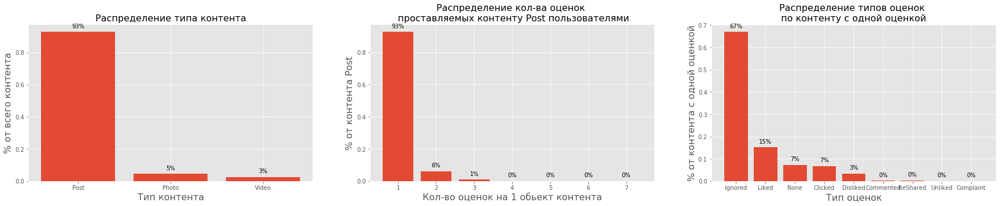

## Прогноз и классификация предпочтений пользователей в системах колаборативной фильтрации
#### Predicting and classification user behaviour with colaborative filtering systems
***

### Входные данные
Входные данные представленны в виде:
- таблицы признаков коллаборативной системы (полученной в том числе с помощью факторизации матриц с помощью SVD, пользовательских счетчиков, жураналов поведений пользователя, других метаданных). Размер матрицы 31 млн. строк на 106 признаков
- таблицы с лемматизироваными текстами
- картинки

- Кол-во уникальных пользователей 3,842,244
- Кол-во уникальных обьектов 6,323,483

***
### Разведочный анализ данных
На этапе разведочного анализа осуществляется:
- анализ, чистка, заполнение пропущенных значений
- выявление и очистка неинформативных признаков содержащих одно значение
- выделение признаков разных типов:
    - дата и время
    - категориальные
    - числовые
    - сылочные (Id, hash)
    - вложенные коллекции
- анализ аномалий и перекосов в данных в пользу того или иного класса
- анализ статистик характеризующих распределение величин признаков

##### анализ пропущенных значений

 
- видим, что в распределении пропущенных значений есть цикличность, а значит есть полезная структура
- в то время как некоторые колонки содержат большое кол-во пропущенных значений
- более светлые значения отражают большую интенсивность NaN-ов
- 19 колонок содержит более 95% пропущенных значений и были удалены

##### Анализ малоинформативных и вложенных признаков
- удалено 18 колонок содержащих малоинформативные признаки - т.е. которые содержат одно значение
- выделена 1 колонка 'metadata_options' - содержащая коллекциии значений
- колонка была развернута и перекодирована т.е. каждое уникальное значение коллекции было выделено в отдельный признак со значением кол-ва данных значений в колекции

##### Описательные статистики

- колонки 'auditweights_numShows' 'auditweights_ageMs' имеют огромный(милиардный, и это не время) расброс значений, а так же выбросы
- диаппазоны значений признаков трейна и теста приблизительно равны
##### статистика по контенту

- Типы контента:
    - post 92 % 
    - photo 4.5% контента
    - video 2.5% 
- 93% контента имеют одну оценку, остальные 2 и 3
- 67% контента Post пользователи не оценивают или игнорируют
- только 15% пользователей контента Post делают оценку Like

##### статистика по пользователям
- Более 50% пользователей ставят от 1 до 5 оценок.
- Большинство пользователей - 18% ставят 2 оценки
- Есть пользователи с аномальным кол-вом оценок больше 1000 - возможно это боты

##### aнализ активности пользователей по времени

- каких-то существенных аномальных перекосов в пользовательской активности не выявлено
- видны недельные циклы пользовательской активности
- ожидалось что в даты близкие к 8 марта и 23 февраля могут быть какие нибудь аномальные активности, но эта гипотеза не подтвердилась

***
### Подготовка датасета
- использовать весь датасет (31млн. строк) для обучения не рентабельно, поэтому просемплируем рандомно небольшую выборку размером с 1,5 млн записей
- поскольку на этапе разведочного анализа не было выявлено каких-то сильных перекосов в распределениях признаков, активности пользователей по времени то возможно применить случайную выборку для семплирования обучающего датасета
- <b>поскольку данные о пользователе в датасете даны за определенный период, то вероятность отнесения пользователя к тому или иному классу может меняться.  Иными словами на начало периода пользователь сделал одну оценку к концу периоды ми имеем  например 30 оценок пользователя, понятно, что к концу периода мы с большей вероятностью можем оценить предпочтения пользователя. То есть современем вероятность принадлежности пользователя к определенному классу "мигрирует"</b>
- этот факт необходимо учесть и дополнительно вводим переменную пользовательской активности 'user activity' (есть другие способы учета "миграции вероятности пользователя")
- после семплирование мы разделяем выборку на обучающий и валидационный датасет в соотношении 70/30% с балансировкой по классам

- доля класса Liked  19%

Весь процесс анализа данных (exploratory data analysis, EDA) представлен в файле: [EDA.ipynb](EDA.ipynb)

***
### Разработка модели
- выбор метода

Here you can find baselines, kernels and other supplementary materials for SNA Hackathon 2019 event. The event is based on news feed ranking challenge split into three parts:

* Ranking feeds based on features, extracted from photos.
* Ranking feeds based on features, extracted from texts.
* Ranking feeds based on collaborative features.

Details are available available at https://mlbootcamp.ru/round/17/tasks/.

All baselines here are written using python 3.7 and based on the [Apache Arrow](https://arrow.apache.org) for reading parquet files (see [manual](https://arrow.apache.org/docs/python/install.html) for installation). Image processing is implemented using [MXNet](https://mxnet.incubator.apache.org) framework (see [manual](https://mxnet.incubator.apache.org/versions/master/install/index.html?platform=MacOS&language=Python&processor=CPU) for instllation) and [GluonCV](https://mxnet.incubator.apache.org/versions/master/gluon/index.html). Texts are processed using [Gensim](https://radimrehurek.com/gensim/) package (see [manual](https://radimrehurek.com/gensim/install.html) for installation).

Content of the package:

* Images.ipynb - baseline for images task based on "catability" (we estimate the probability that there is a cat on an image using [YOLOV3 network](https://gluon-cv.mxnet.io/build/examples_detection/demo_yolo.html) and rank items according to catability).
* Texts.ipnynb - baseline for texts combining [gensim Doc2Vec](https://radimrehurek.com/gensim/models/doc2vec.html) with logistic regression for ranking.
* Collaborative.ipynb - simple baseline for collaborative task, ranking with logistic regression on top features.

More readings
* [The short history of a smart news feed](https://habr.com/ru/company/mailru/blog/438392/)